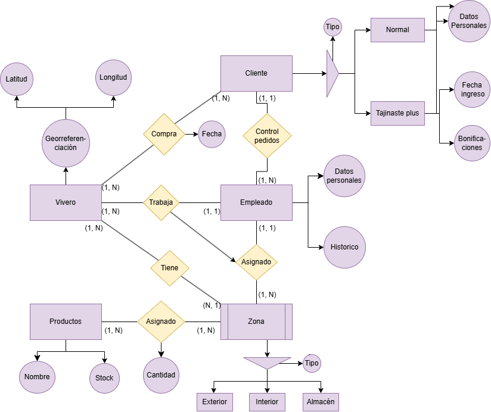

# Modelo-Relacional-Viveros
## Diagrama E/R Viveros

## Tablas de la base de datos Viveros
### Tabla Cliente

### Tabla Vivero

### Tabla Zona

### Tabla Productos

### Tabla Asignado

### Tabla Empleado

### Tabla Compra

### Tabla Control de pedidos

### Tabla Trabaja

### Tabla Tiene

## Ejemplos de DELETE
### Eliminar un cliente y todas sus compras
- DELETE FROM cliente WHERE cliente_id=1;
### Eliminar una zona y todos los productos asignados a ella
- DELETE FROM zona WHERE zona_id=2;
